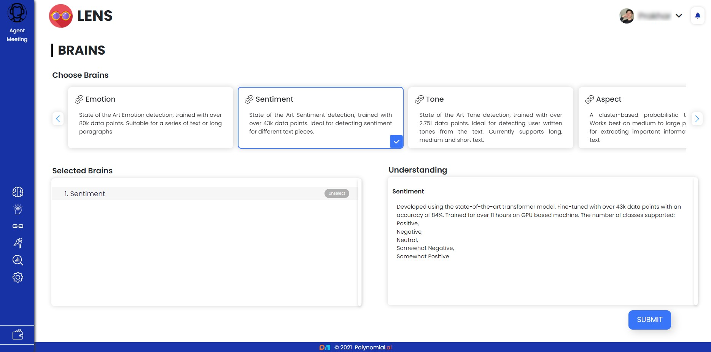
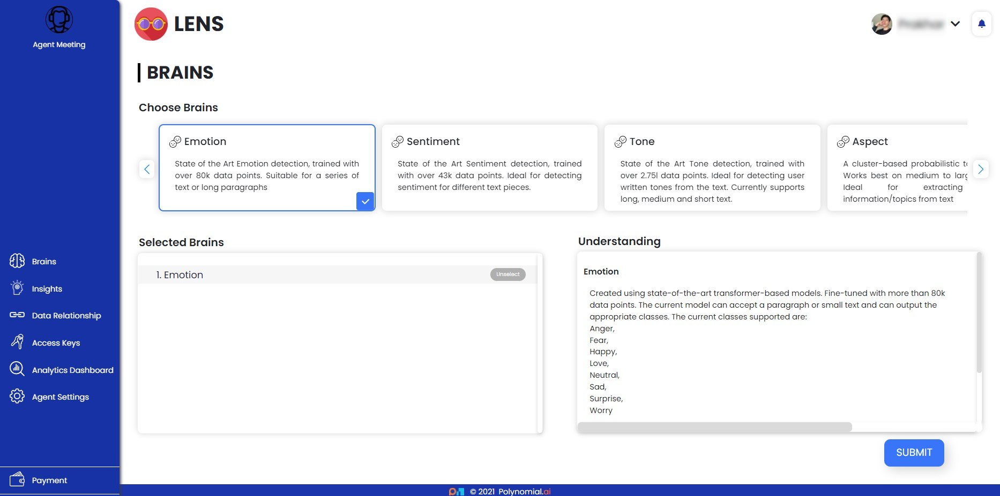
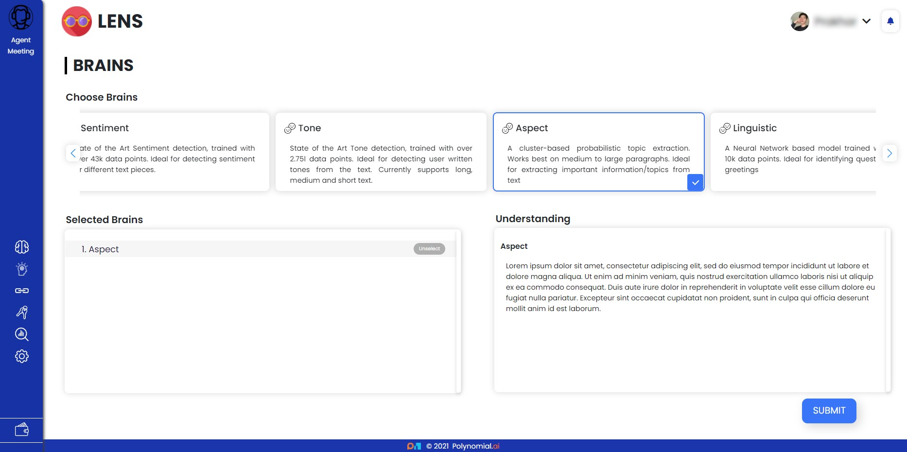
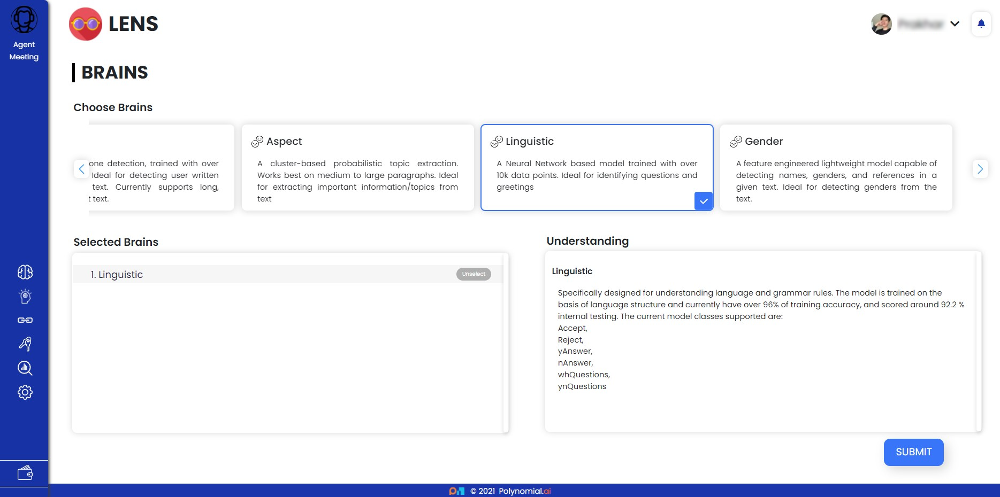
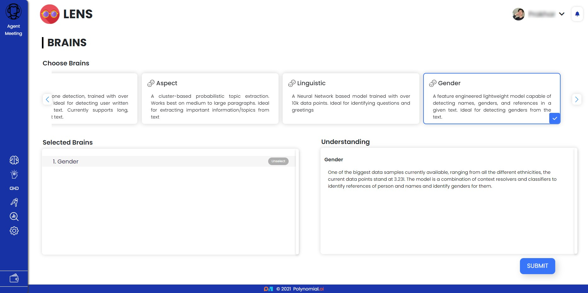

Lens Brains
===============

Lens features state-of-the-art trained machine learning Brains that can
extract detailed insights from any textual source.

.. _some-of-the-brains-are-:

Some of the Brains are :
----------------------------

**Sentiment Brain**
~~~~~~~~~~~~~~~~~~~

Sentiment Detection is a method for determining a speaker's or writer's
mood and emotion based on a computational analysis of the text.
Businesses may find Sentiment Detection Brain to be highly valuable in
determining the social sentiment of their brand, product, or service.
Perfect for identifying sentiment in various text parts.

A state-of-the-art transformer model was used to create this. With over
43k data points and an accuracy of 84 percent, it's been fine-tuned. On
a GPU-based system, trained for nearly 11 hours.

The number of classes supported:

-  Positive
-  Negative
-  Neutral
-  Somewhat Negative
-  Somewhat Positive

**Emotion Brain**
~~~~~~~~~~~~~~~~~

Emotion detection is the technique of finding and interpreting the
emotions conveyed in textual material. In some circumstances, the
sentiment brain may be unable to accurately capture the true feelings.
The emotion brain is a tool for detecting and comprehending the
underlying emotions expressed in textual data. Suitable for a long
paragraph or a series of text.

Models based on state-of-the-art transformers were used to create this
piece. With over 80k data points, it's been fine-tuned. The current
model can take a paragraph or a few lines of text and generate the
necessary classifications.

The current classes supported are:

-  Anger
-  Fear
-  Happy
-  Love
-  Neutral
-  Sad
-  Surprise
-  Worry

**Tone Brain**
~~~~~~~~~~~~~~

Tone detection is a technique for analysing and detecting emotional and
linguistic tones in text. Businesses could benefit from Tone Detection
Brain to learn the tone of their customers' messages, as well as their
brand, product, or service. All types of texts are supported by Tone
Detection Brain.

.. image:: img/tone.png
   :alt: tone

A one-of-a-kind transformer-based model that was fine-tuned with over
2.75 million data points and trained on GPU for more than 20 hours. The
data is acquired automatically from various sources, and the model is
continuously trained and tested. The model's current accuracy is 89
percent.

The classes supported are:

-  Analytical
-  Anger
-  Sadness
-  Fear
-  Confident
-  Analytical

**Aspect Brain**
~~~~~~~~~~~~~~~~

Topic extraction is the process of identifying the words or phrases
that, to the best of one's ability, express the major concepts of a
text. Aspect Brain works best with paragraphs that are medium to large
in size.

Clustering and component analysis, an unsupervised learning method, are
used to extract some of the significant words or phrases.

**Linguistic**
~~~~~~~~~~~~~~

To determine the type of sentences, a neural network-based model was
trained to analyse and interpret the language and grammatical rules.
Identifying questions and greetings has never been easier.

Specifically created to aid in the comprehension of language and grammar
standards. The model is trained on the basis of linguistic structure
with over 10k data points, and it presently has a training accuracy of
over 96 percent and an internal testing accuracy of roughly 92.2
percent.

The current model classes supported are:

-  Accept
-  Reject
-  yAnswer
-  nAnswer
-  whQuestions
-  ynQuestions

**Gender**
~~~~~~~~~~

A lightweight model with advanced features capable of recognising names,
genders, and allusions in a text. Gender detection from text is a breeze
with this tool.

The current data points stand at 3.23l, making it one of the largest
data samples currently available, spanning all ethnicities. The model
combines context resolvers and classifiers to identify references to
people and names, as well as their genders.