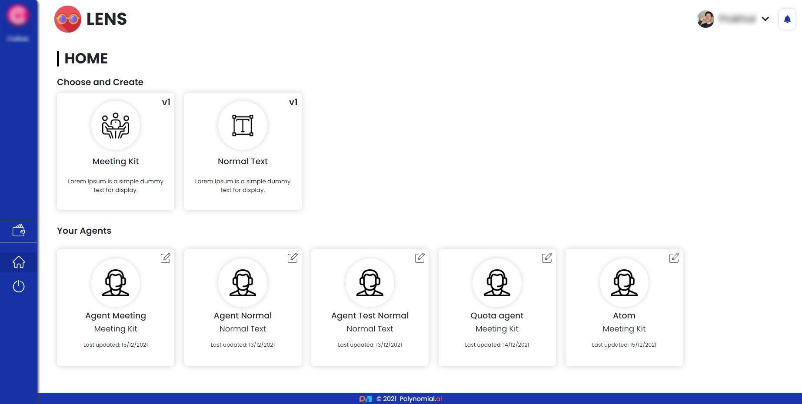
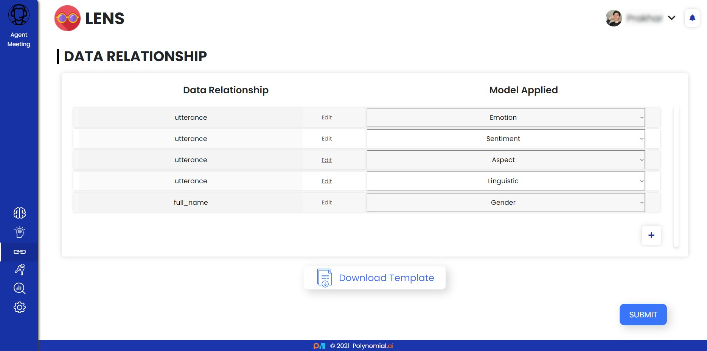

What is Lens?
=============

Lens is a one-of-a-kind Software as a Service (SaaS) that provides
textual insights using a combination of machine learning techniques
trained on millions of data points collected via multiple APIs, powerful
web crawlers and scrapers, open-source data banks, and fine-tuned
state-of-the-art Transformer Models.

What is an Agent?
-----------------

Agents are a custom tool that helps in the selection of Brains and
Sub-Brains, the storage of Access Keys, the selection and modification
of Data Relationships, and provide an Analytical Dashboard for in-depth
study.

What is a Kit?
--------------

Kits are pre-configured agents with Special-Brains that deliver Special
Insights on textual requests.

.. image:: img/analyticDashboard.png
   :alt: analytic