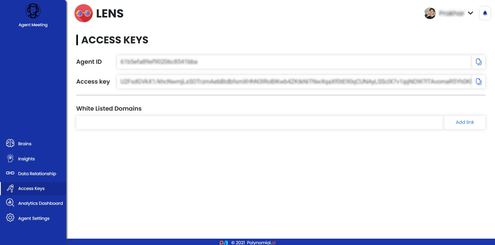

# API Authentication

**Save your API quota from illegal access.**

- It's critical to not only identify who's using your applications, but also to keep your resources safe from illegal access. 
- During the Agent creation process, Lens Agent generates a unique Agent ID and Access Key, which is used to authenticate the API by sending it in the request header.

An image of the app where the user can acquire the Agent ID and Access Key is shown above.

