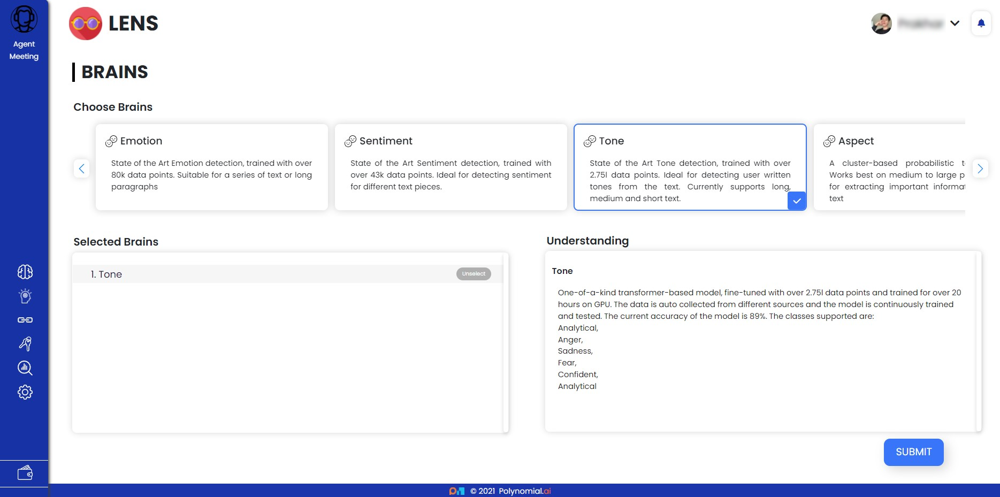
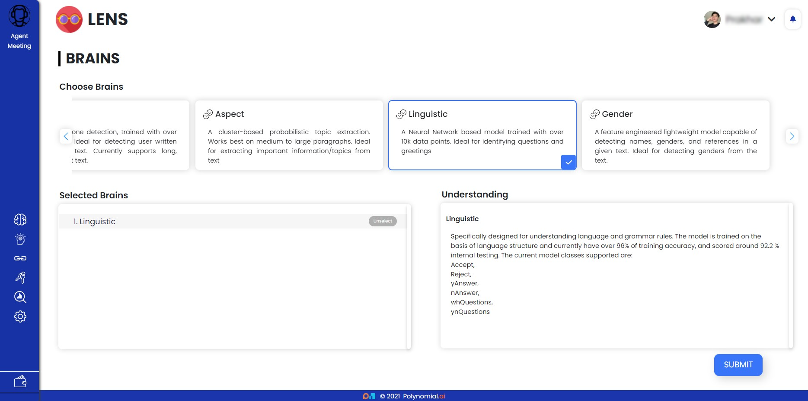

# Lens Brains

Lens has a number of state-of-the-art trained machine learning Brains that can extract detailed insights from any textual source.

Some of the Brains are :

- Sentiment Brain

    Sentiment Detection is the method to measure attitude and emotion of a speaker/writer based on computational treatment of the text. Sentiment Detection Brain could be very useful for businesses to understand the social sentiment of their brand, product or service. Ideal for detecting sentiment for different text pieces.

    

    Developed using the state-of-the-art transformer model. Fine-tuned with over 43k data points with an accuracy of 84%. Trained for over 11 hours on a GPU based machine. 

    The number of classes supported:
    - Positive
    - Negative
    - Neutral
    - Somewhat Negative
    - Somewhat Positive

- Emotion Brain

    Emotion detection is the technique of finding and interpreting the emotions conveyed in textual material.
    In some circumstances, the sentiment brain may fail to capture the true feelings. The technique of discovering and interpreting the underlying emotions portrayed in textual data can be achieved by the emotion brain. Suitable for a series of text or long paragraphs

    

    Created using state-of-the-art transformer-based models. Fine-tuned with more than 80k data points. The current model can accept a paragraph or small text and can output the appropriate classes. 

    The current classes supported are:
    - Anger
    - Fear
    - Happy
    - Love
    - Neutral
    - Sad
    - Surprise
    - Worry

- Tone Brain

    Tone detection is the method to analyse and detect the emotional and language tones in the text. Tone Detection Brain could be very useful for businesses to learn the tone of the customers communications, their brand, product or service. Tone Detection Brain supports all forms of texts. Long, medium and short texts.

    

    One-of-a-kind transformer-based model, fine-tuned with over 2.75l data points and trained for over 20 hours on GPU. The data is auto collected from different sources and the model is continuously trained and tested. The current accuracy of the model is 89%.  

    The classes supported are:
    - Analytical
    - Anger
    - Sadness
    - Fear
    - Confident
    - Analytical

- Aspect Brain

    Topic extraction is the process of identifying the words or phrases that express the main concepts of text to the best of one’s ability. Aspect Brain works best on medium to large paragraphs. 

    

    A cluster-based probabilistic topic extraction.

- Linguistic

    A Neural Network based model trained to analyse and understand the language and the grammar rules to detect the type of sentences. Ideal for identifying questions and greetings.

    

    Specifically designed for understanding language and grammar rules. The model is trained on the basis of language structure with over 10k data points and currently has over 96% of training accuracy, and scored around 92.2 % internal testing. 

    The current model classes supported are:
    - Accept
    - Reject
    - yAnswer
    - nAnswer
    - whQuestions
    - ynQuestions

- Gender

    A feature engineered lightweight model capable of detecting names, genders, and references in a given text. Ideal for detecting genders from the text.

    

    One of the biggest data samples currently available, ranging from all the different ethnicities, the current data points stand at 3.23l. The model is a combination of context resolvers and classifiers to identify references of persons and names and identify genders for them.

